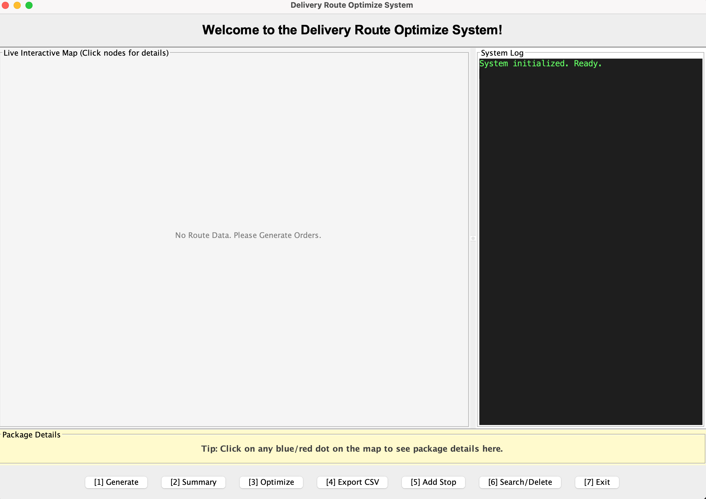
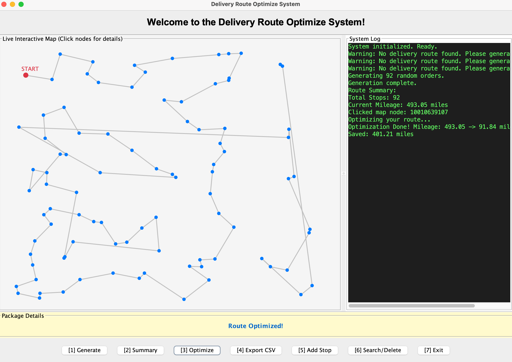

# Logistics Route Optimization System
> A Java-based logistics route optimization project with both console and GUI implementations.
> **This project was independently developed outside any required coursework.

## Project Overview
> This project is a Java-based route optimization and visualization program.
It allows users to define multiple locations, calculate the optimal route between them, and visualize the results through both a console-based interface and a graphical user interface (GUI).
This project was independently developed by me during my studies of data structures, algorithms, and object-oriented programming.

## Motivation & Background
> I started this project while studying computer science at a community college and working part-time as a delivery driver to make ends meet.
While working, I frequently encountered a situation where the next closest location was right nearby, but the system-planned route required me to make a U-turn to a more distant location, and then backtrack along a route I had already traveled. This puzzled me.
After delving deeper into my computer science courses, I wondered if there was an algorithm that could find a shorter route and save me time. That's the purpose of this project.

## Key Features

* Calculate the shortest delivery route using the nearest neighbor greedy algorithm.
* Console-based demo program for testing logic and algorithms.
* Graphical user interface (GUI) demo program for interactive visualization, supporting clicking on map nodes to view package details.
* Modular class design, implemented primarily for learning purposes rather than performance optimization, so using a handwritten doubly linked list to manage data instead of Java's built-in collections.
* Uses regular expressions for input validation, simulating real-world tracking numbers with fixed templates.
* Supports one-click export to Excel spreadsheets.

## Project Structure
### Model & Data
> Location.java 
* Defines the basic attributes of a package (coordinates x/y, tracking number, sequence number).
* Encapsulates distance calculation methods. 

> Node.java
* A basic node for a doubly linked list, containing `prev` and `next` pointers.
* Includes methods for setting the `prev` and `next` pointers.

> Route.java
* Set the head and tail of the entire linked list, and record the length of the linked list.
* The functions of adding, deleting, modifying, and querying elements in the entire linked list have been implemented.
* The `optimizeRoute()` greedy algorithm, which is the core of the entire project, is used to optimize the route.

### View
> RoutePanel.java
* A custom Swing drawing panel. It converts logical coordinates to screen pixels.
* Process mouse click events.

### Controller
> OptimizeRouteDemo.java
* Console debugging version, runs purely in the terminal, without a graphical user interface.

> AppDemo.java
* This is the main entry point of the program, which builds the visual and interactive interface. It connects the `Route` on the backend with the `RoutePanel` on the frontend.
* A split-screen layout was created, with the interactive interface on the left and the system log on the right.
* Process all button clicks and pop-up window logic.

## Demo Preview
* Figure 1: The initial interface of the program upon opening.
  

* Figure 2: Order generation: Randomly generate locations on the map, simulating a real-world work scenario of parcel sorting within a certain area; at this stage, the routes are not yet optimized.
  

* Figure 3: After selecting the optimized route, the system automatically calculates the node closest to the current location, reducing the total route distance by 82%.
  

## What I Learned
> Through this project, I learned a great deal and gained practical experience, complemented what I learned in my coursework.
* I gained a deeper understanding of object-oriented concepts and the responsibilities of each class. The `Location` class is the smallest unit in this project, defining the attributes of a package. The `Node` class, acting like a train car with front and rear couplings, is responsible for packaging this package, and the `Route` class connects all the `Node` train cars together to form a complete "train."
* I gained a clearer understanding of the importance of mathematical knowledge in computer science. The logic of the entire core algorithm `optimizeRoute()` is based on the Pythagorean theorem.
* I learned to design a graphical user interface (GUI) application from scratch.  The school curriculum didn't cover front-end development, so I taught myself front-end development using online tutorials.
* Completing this project significantly improved my ability to translate abstract computer science concepts into practical engineering solutions.

## Future Improvements
> While the project meets its initial goals, there are several areas for improvement.
* Firstly, I want to improve the efficiency of route optimization. During my studies, I learned about a more efficient optimization algorithm called the `simulated annealing algorithm`, but at my current level, I can't understand its principles.  Therefore, I hope to improve this project in the future when I acquire more advanced knowledge.
* I want to enhance the graphical user interface to make the front-end more aesthetically pleasing and modern.  Because I have never worked with front-end development before, the GUI of this project is very basic.
* I want to refactor the code to improve its scalability. Initially, I wanted to obtain the coordinates of every address in the real world to build a project based on real-world data, but after learning that Google Maps API costs money, I had to abandon that idea and instead use planar X/Y coordinates to simulate latitude and longitude.

## How to run
> Compile all Java files and run OptimizeRouteDemo for console mode,
or AppDemo for the graphical interface.